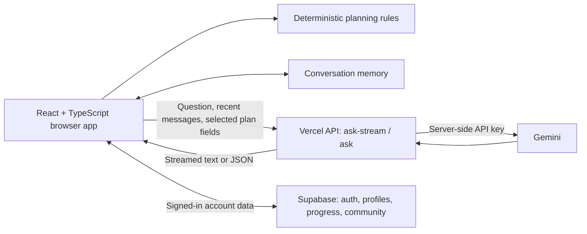

# PreDeparture

PreDeparture helps international students prepare for an exchange in the United States. It turns scattered tasks around visas, housing, insurance, banking, funding and arrival logistics into a personalized roadmap.

The first supported host universities are UC Berkeley and Stanford University.

## What It Does

- Builds a personalized exchange profile from destination, host university, nationality, arrival date and duration
- Generates a chronological checklist before departure and after arrival
- Shows a timeline view for early, pre-departure and arrival-week priorities
- Provides official-source resource guides for visa, housing, insurance, banking, phone setup, funding and arrival
- Supports guest mode for local browser-only planning
- Supports Supabase accounts for profile, checklist and community chat sync
- Includes a Gemini-powered AI assistant through a secure Vercel API route
- Includes cohort-based community groups for students going to the same university and term
- Supports English and French UI language selection saved in the browser

## Tech Stack

- React
- TypeScript
- Vite
- TanStack Router
- Tailwind CSS
- shadcn/radix UI components
- Supabase for optional auth, database sync and community chat
- Vercel serverless API route for the Gemini assistant
- Lightweight local i18n layer in `src/lib/i18n.tsx`

## Requirements

- Node.js `20.19+` or `22.12+`
- npm

The project may fail with Vite errors on older Node versions.

## Getting Started

Install dependencies:

```bash
npm install
```

Run locally:

```bash
npm run dev
```

Build for production:

```bash
npm run build
```

Preview the production build:

```bash
npm run preview
```

The production build is generated in `dist`.

## Environment Variables

Create `.env.local` for local development. Use `.env.example` as the template.

```bash
GEMINI_API_KEY=your_gemini_key_here
VITE_SUPABASE_URL=https://your-project.supabase.co
VITE_SUPABASE_ANON_KEY=your_supabase_anon_key
```

`GEMINI_API_KEY` is server-side only. Do not prefix it with `VITE_`, and do not expose it in frontend code.

Supabase variables are optional for local guest-only testing. Without them, account sync and community chat will not be available.

## Architecture



The browser owns the interface and computes the planning. Vercel functions handle model requests; the model does not directly access the database or modify the user's tasks. Supabase supports account-based persistence and community features.

## Planning and Technical Choices

- **Rules for dates and priorities:** standard task dates use predefined day offsets from the arrival date. Moving the arrival date recalculates the schedule. Custom tasks retain user-entered dates.
- **Explicit user progress:** tasks can be to start, in progress or done. Suggested next actions consider timing and progress; related funding and housing steps are grouped to avoid filling the recommendations with the same topic.
- **Deterministic planning, generative explanations:** Gemini explains the supplied plan and answers questions; it is not the engine that calculates checklist dates. This keeps the planning reproducible even when model responses vary.
- **Progressive disclosure:** grouped cards retain individual task progress and show details on demand, with a shared guide link.
- **Optional accounts:** users can explore the product without registering; accounts enable synchronized data and community participation.

Relevant implementation: [planning rules](src/lib/next-actions.ts), [task definitions](src/lib/tasks.ts), [personalization](src/lib/personalized-tasks.ts), and [dashboard](src/routes/dashboard.tsx).

## AI Assistant

The chat uses `/api/ask-stream` to display responses progressively. A separate `/api/ask` endpoint returns a complete JSON response. Both run as Vercel functions and call Gemini with the server-side `GEMINI_API_KEY`; the key is never sent to the browser.

### Context and response handling

- Requests include the question, recent conversation, interface language and host university. When a saved plan exists, they also include arrival date, duration, task titles, statuses and planning dates.
- The server bounds message lengths and context size and accepts only supported fields and conversation roles. Account identifiers and email are not added as structured assistant context; free-text messages may still contain information the user supplies.
- Simple greetings and narrowly recognized profile summaries can be answered directly without model generation. Some standalone general questions also use predefined replies or a short-lived browser cache; contextual conversations and saved-plan requests bypass that cache.
- The model is instructed to distinguish saved personal information from external requirements, avoid inventing missing details and avoid assigning a visa category from the university name alone.
- Streaming completion is checked explicitly. Interrupted answers are marked incomplete, with stop/retry controls and separate handling for timeouts, service failures and quota limits.

### Conversation and navigation

The active conversation lives in browser memory and survives navigation between app pages. “New conversation” clears it, and changing the conversation owner clears the previous account's exchange. Reloading the page starts a fresh conversation; there is no permanent assistant chat archive in the application.

Selected terms such as DS-160, SEVIS, profile and planning become inline links to curated destinations. Internal links use client-side navigation; external links open separately. Model-generated text is rendered through a small escaped Markdown subset, rather than interpreted as HTML.

Relevant implementation: [request normalization and instructions](src/lib/assistant-request.ts), [streaming endpoint](api/ask-stream.ts), [JSON endpoint](api/ask.ts), [client](src/lib/assistant.ts), [conversation memory](src/lib/assistant-memory.ts), and [curated links](src/lib/assistant-links.ts).

## Current AI Limitations

- **No live browsing or retrieval-augmented generation:** the assistant does not fetch official documents before answering. Curated links are navigation aids, not evidence that their pages were consulted.
- **Generated answers can be inaccurate:** prompt instructions reduce unwanted behavior but do not guarantee factual correctness or resistance to every misleading input.
- **Planning targets are estimates:** dates calculated by the app are not embassy appointments, university deadlines or confirmed legal requirements.
- **Bounded context:** only recent messages and selected planning fields are sent; the assistant has neither unlimited memory nor access to every account field.
- **No autonomous actions:** the assistant cannot submit applications, book appointments or update the saved profile and checklist on the user's behalf.
- **External processing:** questions and selected context are sent to Gemini for generated responses. In-memory chat storage in this app does not imply that no external service processes the request.

## Supabase Setup

PreDeparture works without Supabase in guest mode. To enable accounts, cloud checklist sync and community chat:

1. Create a Supabase project.
2. Add `VITE_SUPABASE_URL` and `VITE_SUPABASE_ANON_KEY` to `.env.local` and to your Vercel environment variables.
3. In Supabase, open `Authentication -> URL Configuration`.
4. Set the Site URL to your deployed site, for example `https://your-project.vercel.app`.
5. Add redirect URLs:

```text
https://your-project.vercel.app/auth
http://localhost:5173/auth
```

6. Run [supabase/schema.sql](./supabase/schema.sql) in the Supabase SQL editor.
7. Enable Realtime for `predeparture_community_messages` if it is not enabled automatically.

The SQL file creates profile, progress, community membership and community message tables with row-level security policies.

## Deployment

### Vercel

Recommended deployment target.

- Build command: `npm run build`
- Output directory: `dist`
- Node version: `20.19+` or `22.12+`
- Add environment variables in `Project Settings -> Environment Variables`
- SPA rewrites are configured in `vercel.json`

Required for the AI assistant:

```text
GEMINI_API_KEY
```

Optional for auth and community:

```text
VITE_SUPABASE_URL
VITE_SUPABASE_ANON_KEY
```

### Netlify

The static app can be deployed to Netlify, but `/api/ask` is currently implemented as a Vercel serverless function. For Netlify, create an equivalent Netlify Function or deploy the app on Vercel for the AI assistant to work without changes.

Static deployment settings:

- Build command: `npm run build`
- Publish directory: `dist`
- Add a SPA redirect to `index.html`

## Useful Commands

```bash
npm run dev
npm run build
npm run preview
```

Type-checking:

```bash
./node_modules/.bin/tsc --noEmit
```

## Project Notes

- Guest mode stores the roadmap in the current browser only.
- Signed-in users sync profile and checklist data to Supabase.
- Signing out clears local roadmap data so another person using the same device does not see the previous account's data.
- Community cohorts are based on host university and arrival term, for example `UC Berkeley - Fall 2026`.
- The app is a preparation tool, not an official university, immigration, legal, medical or financial authority.
- Deadlines and requirements are planning guidance. Students should verify important details with official university, embassy or government websites before paying fees, booking appointments, signing housing contracts or submitting documents.
